## Hello There 👋

My name is Miguel 👨‍🔬, and I am a PhD in Robotics and AI 🤖 working at the Robotics Group of the University of León 🎓. I am passionate about robotics 🤖, cognitive architectures 🧠, software for robots 🖥️, artificial intelligence 💡, mobile robots 🦿, localization systems 🗺 and space robotics 🚀.

## 🌐 Socials

     

## 🚀 Tech Skills

                    

## 📊 GitHub Statistics

<!--  -->

## 🏆 GitHub Trophies

---

### 📈 Profile Views

